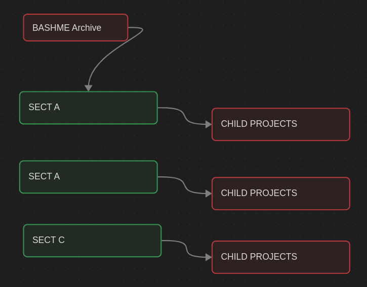

# BashMe-Archive
A general repo for Automation scripts written in Bash, Python and Javascript, designed to simplify daily workflows and solve problems efficiently.

## Project Structures
The repository is organized into section based on the complexity and type of automation task. 
Each section contains child project folders,each representing an individual automation script or project.




#### SECT A: This includes basic automation scripts for small, frequent, or non-tedious tasks. These are designed for quick fixes, personal utilities, and simple daily workflows. <br>
**Examples:**
- backup scripts
- basic system info 
- folder clean-up utilities


#### SECT B: This includes intermediate level scripts that handle low-level tasks for more structured workflows. <br>
**Examples:**
- Log monitoring tools
- Automated installers or setup scripts
- Process management or cron job utilities

#### SECT C: This includes Advanced automation script for complex or large scale tasks. These often integrate with APIs, databases, or network systems, and are suitable for technical or production-level automation.

**Examples:**
- Server or deployment automation
- API-driven automation tools
- Data Processing Pipeline
<br>


### Usage 

1. Clone the Repository 
```bash 
git clone https://github.com/<your-username>/BashMe-Archive.git
cd BashMe-Archive
 ```
2. Navigate to the desired section:
```bash
cd "SECT A/CHILD PROJECTS"
```
3. Run the script (example for Bash):
```bash
bash your_script.
```

### Contributing 
Contributions are welcome!
if you'd like to add a new automation script:
1. Fork the repository 
2. Create a new folder under the appropriate section(A,B, or C)
3. Add your script with a short ``README.md`` explaining what it does.
4. Submit a pull request 

### License
This repository is licensed under the [License](./LICENSE)


